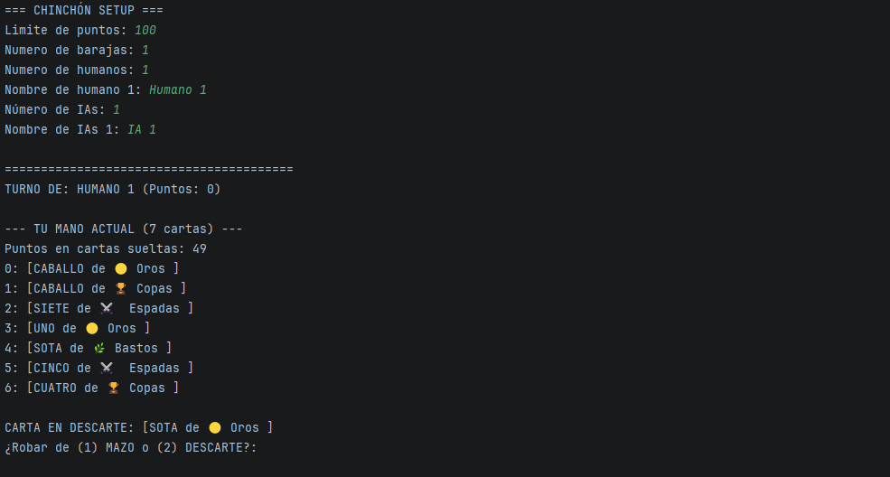
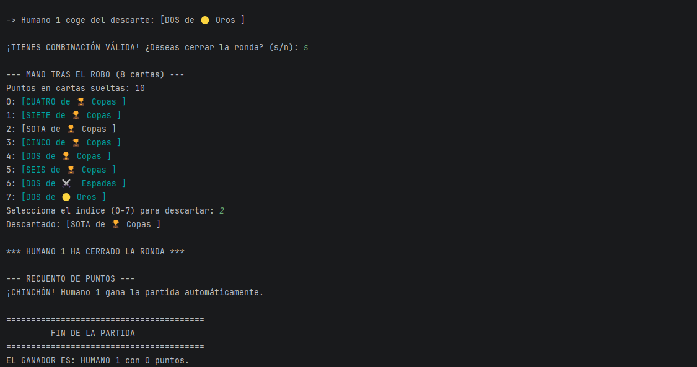
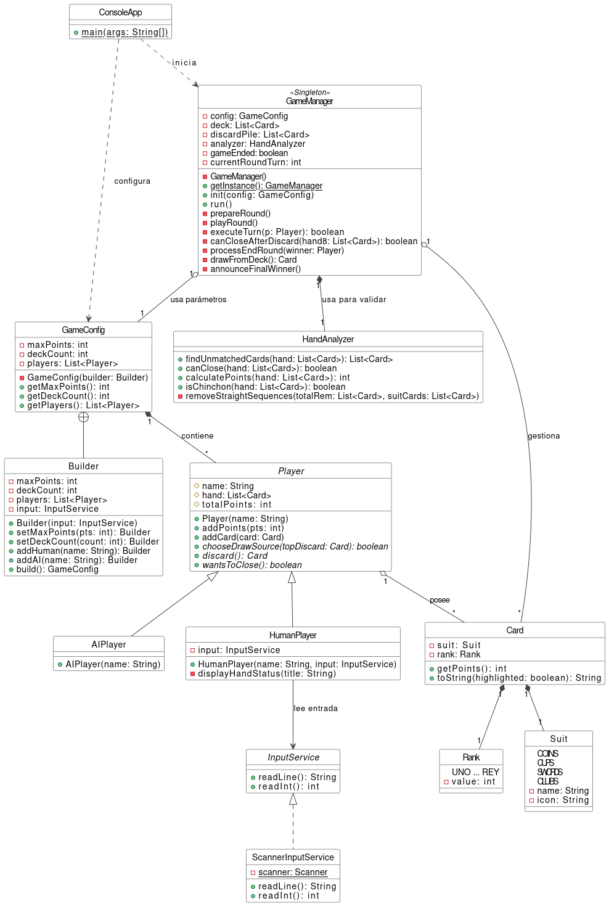
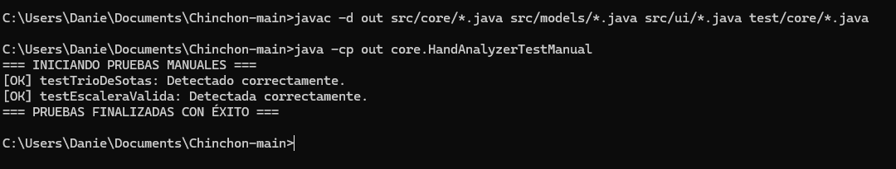

# Chinchón - Proyecto 1º DAM

Una implementación modular y ejecutable en Java del clásico juego de cartas **Chinchón**. Este proyecto sirve como evidencia práctica para la evaluación conjunta de los módulos de **Programación** y **Entornos de Desarrollo**.

---

## 1. Explicación del Juego

### Objetivo del Juego
El objetivo es terminar las rondas con la menor cantidad de puntos posible en la mano. La partida acaba cuando alguno de los jugadores supera el límite establecido al inicio (por defecto, 100 puntos).

### Características Principales
* **Motor de Juego Automatizado:** Controla de forma centralizada los turnos, el mazo y el reciclaje del descarte.
* **IA Competitiva:** Bots capaces de analizar sus cartas, descartar de forma inteligente y cerrar cuando les conviene.
* **Interfaz Limpia:** Salida por consola con colores ANSI y Emojis para emular las cartas de la baraja española.

### Reglas y Jugabilidad
1. **Reparto:** Se reparten 7 cartas a cada jugador y se deja una descubierta en la pila de descartes.
2. **Dinámica de Turno:** En tu turno debes robar una carta (del mazo o del descarte), evaluar tus combinaciones (tríos/cuartetos de igual número o escaleras del mismo palo) y soltar una carta obligatoriamente para volver a tener 7.
3. **El Cierre:** Puedes cerrar la ronda si, tras robar y hacer tu descarte, te queda:
   * 0 puntos sueltos (toda la mano combinada), lo que te da un premio de **-10 puntos**.
   * Una sola carta suelta que valga **5 puntos o menos**.
4. **Chinchón:** Si logras combinar las 7 cartas en una única escalera limpia, ganas la partida directamente.

### Interfaz y Capturas de Pantalla

#### Ejecución del juego


#### Cierre del juego


---

## 2. Análisis del Proyecto

### Estructura del Proyecto e Ingeniería de Directorios
El proyecto está organizado separando el código que hace funcionar el juego de los scripts de pruebas del sistema:

* [`src/`](./src): Código fuente de producción de la aplicación.
    * [`core/`](./src/core): El motor lógico y el configurador del juego.
    * [`models/`](./src/models): Las entidades del juego (cartas, jugadores, enums).
    * [`ui/`](./src/ui): La lectura de teclado y la salida por consola.
* [`test/`](./test): Directorio independiente para las pruebas de código.
* `uml.drawio.png`: Archivo con el diagrama de clases del sistema.

---

## 3. Modelo del Sistema (UML)

### Diagrama de Clases Actualizado
El siguiente diagrama muestra la estructura del juego y cómo se relacionan los diferentes componentes que he programado:



### Tipos de Relaciones Implementadas
* **Herencia (`extends`):** Aplicada en `HumanPlayer` y `AIPlayer` con respecto a la clase madre `Player`. Ambas comparten la estructura base de datos pero resuelven los métodos de juego de forma totalmente distinta (polimorfismo).
* **Agregación:** `GameConfig` guarda una lista de objetos `Player`. Los jugadores existen dentro de la configuración de la partida actual, pero sus ciclos de vida no dependen rígidamente de ella.
* **Composición:** La clase `Player` compone la mano de cartas (`List<Card>`). Si un jugador se destruye o se reinicia la ronda, esa lista concreta de cartas desaparece de la memoria de la partida.
* **Dependencia (`uses`):** El motor `GameManager` depende de `HandAnalyzer` para validar jugadas y de `InputService` para pedir datos, invocando sus métodos públicos cuando el turno lo requiere.

### Descripción de Responsabilidades por Clase

#### Paquete `core` (Lógica Central)
* **[`GameManager`](./src/core/GameManager.java):** Lleva el control de los turnos, gestiona cuándo se vacía el mazo para reciclar el descarte y calcula los puntos al final de cada ronda.
* **[`HandAnalyzer`](./src/core/HandAnalyzer.java):** Busca qué cartas se pueden agrupar, aísla las cartas sueltas y calcula cuántos puntos penalizan.
* **[`Builder`](./src/core/Builder.java):** Se encarga de montar el objeto de configuración paso a paso.

#### Paquete `models` (Entidades del Dominio)
* **[`Player`](./src/models/Player.java):** Clase abstracta con los datos comunes de cualquier jugador (nombre, puntos acumulados y mano).
* **[`HumanPlayer`](./src/models/HumanPlayer.java):** Controla las acciones del usuario pidiendo los índices por consola.
* **[`AIPlayer`](./src/models/AIPlayer.java):** Implementa las decisiones de la máquina de forma automática.
* **[`Card`](./src/models/Card.java):** Una carta inmutable con su palo y su rango.
* **[`Rank`](./src/models/Rank.java) / [`Suit`](./src/models/Suit.java):** Enums que definen de forma fija los valores de la baraja española y sus emojis representativos.

#### Paquete `ui` (Interfaz de Usuario)
* **[`ConsoleApp`](./src/ui/ConsoleApp.java):** El método `main` que arranca la configuración inicial y lanza el bucle del juego.
* **[`InputService`](./src/ui/InputService.java) / [`ScannerInputService`](./src/ui/ScannerInputService.java):** Se encargan de encapsular y proteger las lecturas de teclado para que el programa no falle si metes un dato erróneo.

---

## 4. Patrones de Diseño Implementados

### 1. Patrón Singleton
* **Dónde está:** En [`GameManager`](./src/core/GameManager.java).
* **Justificación:** Necesitamos un único motor controlando la partida actual, el mazo y la pila de descartes. Usar un Singleton evita que se dupliquen partidas en memoria o se corrompan los datos de los turnos, manteniendo una **alta cohesión** en el flujo de juego.

### 2. Patrón Builder
* **Dónde está:** En [`Builder`](./src/core/Builder.java).
* **Justificación:** Crear una partida requiere combinar muchos datos (puntos máximos, cuántas barajas se usan, cuántos humanos entran y cuántas IAs). Este patrón nos evita tener constructores gigantescos y engorrosos, permitiendo instanciar configuraciones de forma limpia y por pasos.

### 3. Polimorfismo y Bajo Acoplamiento
* **Dónde está:** En la herencia de los métodos `.discard()` y `.wantsToClose()` de [`Player`](./src/models/Player.java).
* **Justificación:** El motor `GameManager` trata a todos los participantes simplemente como objetos `Player`. Al invocar un descarte o una comprobación de cierre, es Java el que decide de forma dinámica en tiempo de ejecución si lanza el escáner de consola para el humano o el cálculo automático para la IA.

---

## 5. Pruebas Unitarias y Diseño de Tests

### Enfoque Utilizado
Para asegurar que el analizador de combinaciones funciona sin fallos, los tests se centran en la clase `HandAnalyzer` y se han diseñado aplicando las metodologías estudiadas:

1.  **Caja Negra (Diseño Funcional):** Probamos el comportamiento externo del método basándonos en el reglamento, sin importarnos cómo está programado por dentro.
2.  **Caja Blanca (Diseño Estructural):** Analizamos las líneas de código internas (bucles y condiciones) para forzar al programa a entrar por caminos específicos y comprobar que responde bien bajo estrés.

### Ubicación y Organización de los Tests
Los archivos de prueba están situados estrictamente fuera de la carpeta de producción `src`, respetando los estándares de ordenación:
* RUTA: [`test/core/HandAnalyzerTestManual.java`](./test/core/HandAnalyzerTestManual.java)

### Justificación de los Escenarios de Prueba

#### 1. Test de Caja Negra (`testEscaleraValida`)
* **Cómo funciona:** El test le pasa al analizador una mano con un 1, 2 y 3 de Espadas (escalera reglamentaria) y un Rey de Bastos suelto. Sin mirar qué bucle interno ejecuta el software, esperamos que la salida sea exactamente una única carta suelta (el Rey). Al coincidir la salida con lo que dice la norma del juego, la prueba pasa con éxito (`[OK]`).

#### 2. Test de Caja Blanca (`testTrioDeSotas`)
* **Cómo funciona:** Aquí miramos el código de `HandAnalyzer.java` para testear la condición condicional `if (group.size() >= 3)`. Introducimos aposta 3 Sotas en la mano para obligar a que esa condición se evalúe como verdadera (`true`). Con esto validamos que la rama estructural encargada de limpiar las listas de cartas sueltas con `remaining.removeAll(group);` funciona en memoria sin provocar excepciones de puntero nulo o bucles infinitos.

### Evidencias de Ejecución
#### 

---

## 6. Procesos de Refactorización

Durante el desarrollo de la aplicación se aplicaron varias técnicas de refactorización para limpiar el código viejo y cumplir con los criterios de código limpio:
* **Extracción de Interfaces (Aislamiento de I/O):** Se separó la lectura directa de consola del código del juego mediante la interfaz `InputService`. De este modo, la lógica de negocio no depende de `Scanner` y cumple con el principio de responsabilidad única.
* **Flujos Transaccionales Atómicos:** Se reestructuró la fase de descarte y cierre dentro del motor `GameManager`. En las primeras versiones del código, si un jugador intentaba un cierre que resultaba ser inválido, se alteraba el tamaño de su mano perdiendo cartas en el proceso. La lógica actual soluciona esta vulnerabilidad asegurando que el estado de la mano se mantenga íntegro antes de confirmar el descarte definitivo.

---

## 7. Documentación Técnica (JavaDoc)

Todo el código fuente del proyecto está comentado siguiendo el estándar formal **JavaDoc**, incluyendo las etiquetas para parámetros (`@param`), retornos (`@return`) y excepciones.

Para autogenerar las páginas HTML de la documentación interactiva en el directorio local `docs/`, se puede lanzar el siguiente comando en la terminal:
```bash
javadoc -d docs -sourcepath src -subpackages core models ui